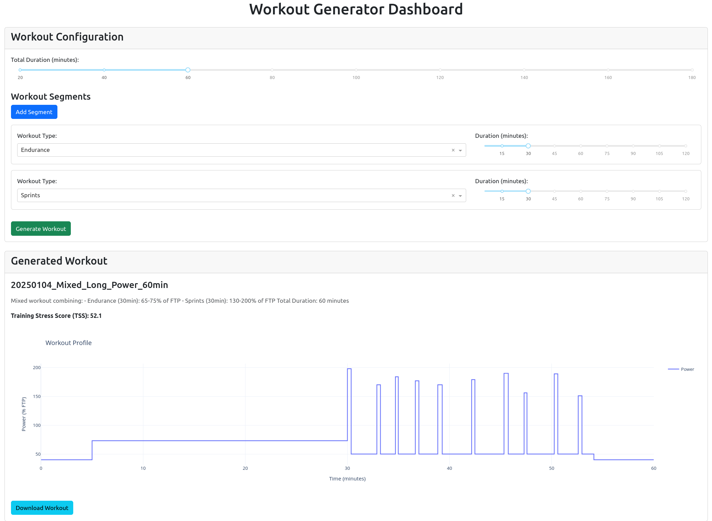

# 🚲 PainCave Workout Generator 🔥

Generate structured, professional-grade cycling workouts for your indoor training sessions. Turn your pain cave into a power factory!


## 🎯 Features


### 🏋️‍♂️ Workout Types
- **Endurance** - Long, steady efforts to build your aerobic engine
- **Threshold** - FTP-focused intervals that make you question your life choices
- **VO2 Max** - Oxygen-hungry intervals that make your lungs burn
- **Tempo** - Sustained power that feels uncomfortable... but sustainable
- **Zone 2** - Because sometimes you need to actually enjoy riding
- **Sprints** - Short, explosive efforts that make your neighbors think there's an earthquake

### 🎮 Smart Features
- **Intelligent Workout Generation** - Each workout is randomly generated within sport-science parameters
- **TSS Calculation** - Track your training stress score
- **Calorie Estimation** - Know how many donuts you've earned
- **Smart Naming** - Automatically generate workout names that don't just say "Workout_1"

## 🚀 Getting Started

### Prerequisites
```bash
python 3.7+
```

### Installation
```bash
git clone https://github.com/yourusername/paincave-generator.git
cd paincave-generator
pip install -r requirements.txt
```

### Quick Start
```python
from enduWorkoutGen.workoutgen import  WorkoutGenerator, WorkoutParameters, WorkoutType

# Create a suffer-fest
generator = WorkoutGenerator()
params = WorkoutParameters(
    workout_type=WorkoutType.THRESHOLD,
    duration_minutes=60,
)

# Generate your pain
workout = generator.generate_workout(params)
```

## 📊 Example Workouts

### The "Lung Buster" (VO2 Max)
```
🔥 45 minutes of "fun"
🎯 Target: 106-120% FTP
📈 Includes:
- 5 min warmup
- 6-8 high-intensity intervals
- Recovery periods
- 5 min cooldown
```

### The "Sweet Spot Special" (Threshold)
```
🔥 60 minutes of sustainable suffering
🎯 Target: 95-105% FTP
📈 Includes:
- Progressive warmup
- 3-4 threshold blocks
- Active recovery
- Controlled cooldown
```

## 🔧 Customization

### Adjust Intensity Ranges
```python
generator.intensity_ranges[WorkoutType.SPRINTS] = (140, 220)  # For when regular sprints aren't hard enough
```

### Custom Workout Names
```python
generator.workout_names[WorkoutType.THRESHOLD].append("The Pain Provider")
```

## 📄 File Formats
Currently supports:
- **MRC** - Compatible with most smart trainers
- More formats coming soon!

## 🏆 Usage Examples

### The "I Have 30 Minutes" Workout
```python
quick_burn = WorkoutParameters(
    workout_type=WorkoutType.VO2,
    duration_minutes=30
)
```

### The "Sunday Base Miles" Session
```python
lazy_sunday = WorkoutParameters(
    workout_type=WorkoutType.ENDURANCE,
    duration_minutes=120,
)
```

## 🎯 Training Zones Reference
```
Zone 1: <55% FTP  - Active Recovery
Zone 2: 56-75%    - Endurance
Zone 3: 76-90%    - Tempo
Zone 4: 91-105%   - Threshold
Zone 5: 106-120%  - VO2 Max
Zone 6: >121%     - Anaerobic
```
# 📈 Dashboard 
The EnduWorkout Generator includes a user-friendly dashboard for generating and visualizing your workouts. 
Easily add workout segments, generate structured workouts, and download them in compatible formats.


## 🐳 Docker Setup

### Prerequisites
- Docker installed on your machine
- Docker Compose (optional)

### Building the Docker Image
```bash
# Clone the repository
git clone https://github.com/yourusername/paincave-generator.git
cd paincave-generator

# Build the Docker image
docker build -t paincave-app .
```

### Running the Container
```bash
# Run the container
docker run -p 8050:8050 paincave-app
```

The application will be available at `http://localhost:8050`

### Development Setup with Volume Mounting
For development purposes, you can mount your local directory to see live changes:
```bash
docker run -p 8050:8050 -v $(pwd):/app paincave-app
```

### Environment Variables (Optional)
If you need to set environment variables:
```bash
docker run -p 8050:8050 -e VARIABLE_NAME=value paincave-app
```

### Using Docker Compose (Optional)
Create a `docker-compose.yml` file:
```yaml
version: '3'
services:
  web:
    build: .
    ports:
      - "8050:8050"
    volumes:
      - .:/app
```

Then run:
```bash
docker-compose up
```

### Stopping the Container
```bash
# If running with docker run
docker ps
docker stop <container_id>

# If running with docker-compose
docker-compose down

## 🚧 Roadmap
- [X] Zwift workout file (.zwo) export
- [ ] TrainerRoad file export
- [ ] Workout progression planning
- [ ] Multi-week training plan generation
- [ ] Power curve optimization
- [ ] Integration with training peaks

## 🤝 Contributing
Pull requests are welcome! For major changes, please open an issue first to discuss what you would like to change.

## 📝 License
MIT License - See LICENSE.md for details

## 💬 Quotes from Users
> "I thought I knew pain before using this generator" - Local Cyclist

> "My FTP went up 20 watts in 6 weeks!" - Happy User

> "Who hurt you?" - My Legs

## ⚠️ Disclaimer
This tool is designed to generate structured workouts, but remember to:
- Listen to your body
- Stay hydrated
- Consider consulting with a coach
- Have a fan... or three
- Keep emergency snacks nearby

## 🤔 FAQ

**Q: Why isn't the workout hard enough?**  
A: Are you sure you entered your correct FTP? Or are you just a beast?

**Q: Will this make me faster?**  
A: Combined with proper recovery and nutrition, probably. Results may vary!

## 🙏 Acknowledgments
- Peter for the crazy idea to race ultramarathons
- Manufacturers of cooling fans
- Whoever invented chamois cream

---
Remember: Pain is temporary, Strava KOMs are for eternity! 🚴‍♂️💨

*Now go forth and suffer!* 💪